#.1. Find the names and ages of all sailors.
```
CREATE TABLE Sailors (
  sid NUMBER PRIMARY KEY,
  sname VARCHAR2(20),
  rating NUMBER,
  age NUMBER
);
```
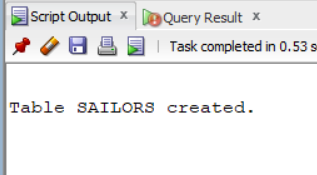
```
```

#.2.Find all sailors with a rating above 7.
```
SELECT * FROM Sailors
WHERE rating > 7;
```
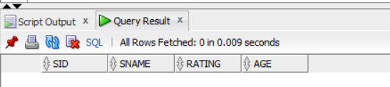
```
```
#.3.Find the names of sailors who have reserved boat number 103.
```
DROP TABLE Reserves;
DROP TABLE Boats;
DROP TABLE Sailors;
CREATE TABLE Sailors (
 sid NUMBER PRIMARY KEY,
 sname VARCHAR2(30),
 rating NUMBER,
 age NUMBER
);

CREATE TABLE Boats (
 bid NUMBER PRIMARY KEY,
 bname VARCHAR2(30),
 color VARCHAR2(20)
);

CREATE TABLE Reserves (
 sid NUMBER REFERENCES Sailors(sid),
 bid NUMBER REFERENCES Boats(bid),
 day DATE,
 PRIMARY KEY (sid, bid, day)
);
```
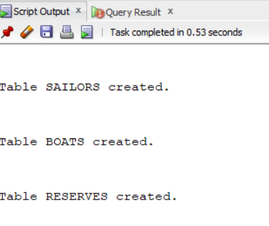
```
```

#.4. Find the sids of sailors who have reserved a red boat.
```
SELECT DISTINCT r.sid FROM Reserves r, Boats b WHERE r.bid = b.bid AND b.color = 'red';

```
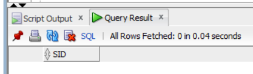
```
```

#.5. Find the names of sailors who have reserved a red boat.
```
SELECT DISTINCT b.color
FROM Sailors s, Reserves r, Boats b
WHERE s.sid = r.sid AND r.bid = b.bid AND s.sname = 'Lubber';
```
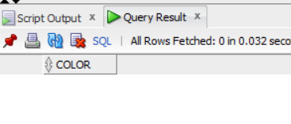
```
```
#.6. Find the colors of boats reserved by Lubber.
```
SELECT DISTINCT b.color FROM Sailors s, Reserves r, Boats b WHERE s.sid=r.sid AND r.bid=b.bid AND s.sname='Lubber';
```
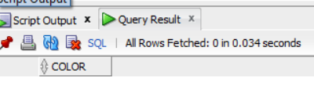
```
```
#.7. Find the names of sailors who have reserved at least one boat.
```
SELECT DISTINCT s.sname
FROM Sailors s, Reserves r
WHERE s.sid = r.sid;
```
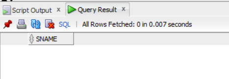
```
```

#.8. Compute increments for the ratings of persons who have sailed two different boats on the same day.
```
UPDATE Sailors
SET rating = rating + 1
WHERE sid IN (
SELECT r1.sid
FROM Reserves r1, Reserves r2
WHERE r1.sid = r2.sid
AND r1.day = r2.day
AND r1.bid <> r2.bid
);
```
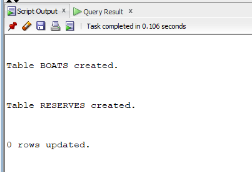
```
```

#.9. Find the ages of sailors whose name begins and ends with B and has at least three characters.
```
SELECT age
FROM Sailors
WHERE sname LIKE 'B_%B';
```
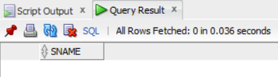
```
```

#.10. Find the names of sailors who reserved a red boat or a green boat.
```
SELECT s.sname FROM Sailors s, Reserves r, Boats b WHERE s.sid=r.sid AND r.bid=b.bid AND b.color='red'
INTERSECT
SELECT s.sname FROM Sailors s, Reserves r, Boats b WHERE s.sid=r.sid AND r.bid=b.bid AND b.color='green';
```
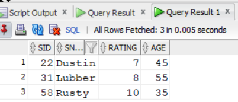
```
```

#.11. Find the names of sailors who have reserved both a red and a green boat.
```
DROP TABLE Reserves;
DROP TABLE Boats;
DROP TABLE Sailors;

CREATE TABLE Sailors(sid NUMBER PRIMARY KEY, sname VARCHAR2(30), rating NUMBER, age NUMBER);
CREATE TABLE Boats(bid NUMBER PRIMARY KEY, bname VARCHAR2(30), color VARCHAR2(30));
CREATE TABLE Reserves(sid NUMBER, bid NUMBER, day DATE, PRIMARY KEY(sid,bid,day));

INSERT INTO Sailors VALUES(22,'Dustin',7,45);
INSERT INTO Sailors VALUES(31,'Lubber',8,55);
INSERT INTO Sailors VALUES(58,'Rusty',10,35);
INSERT INTO Boats VALUES(101,'Interlake','blue');
INSERT INTO Boats VALUES(102,'Interlake','red');
INSERT INTO Boats VALUES(103,'Clipper','green');
INSERT INTO Boats VALUES(104,'Marine','red');
INSERT INTO Reserves VALUES(22,101,DATE '1998-10-10');
INSERT INTO Reserves VALUES(31,103,DATE '1998-11-10');
INSERT INTO Reserves VALUES(31,102,DATE '1998-11-12');
INSERT INTO Reserves VALUES(58,103,DATE '1998-11-12');
SELECT * FROM Sailors;
```

```
```

#.12. Find the sids of sailors who have reserved red boats but not green boats.
```
DROP TABLE Reserves;
DROP TABLE Boats;
DROP TABLE Sailors;

CREATE TABLE Sailors(sid NUMBER PRIMARY KEY, sname VARCHAR2(30), rating NUMBER, age NUMBER);
CREATE TABLE Boats(bid NUMBER PRIMARY KEY, bname VARCHAR2(30), color VARCHAR2(30));
CREATE TABLE Reserves(sid NUMBER, bid NUMBER, day DATE, PRIMARY KEY(sid,bid,day));

INSERT INTO Sailors VALUES(22,'Dustin',7,45);
INSERT INTO Sailors VALUES(29,'Brutus',1,33);
INSERT INTO Sailors VALUES(31,'Lubber',8,55);
INSERT INTO Sailors VALUES(32,'Andy',8,25);
INSERT INTO Sailors VALUES(58,'Rusty',10,35);

INSERT INTO Boats VALUES(101,'Interlake','blue');
INSERT INTO Boats VALUES(102,'Interlake','red');
INSERT INTO Boats VALUES(103,'Clipper','green');
INSERT INTO Boats VALUES(104,'Marine','red');

INSERT INTO Reserves VALUES(22,101,DATE '1998-10-10');
INSERT INTO Reserves VALUES(22,102,DATE '1998-10-11');
INSERT INTO Reserves VALUES(22,103,DATE '1998-10-08');
INSERT INTO Reserves VALUES(31,102,DATE '1998-11-12');
INSERT INTO Reserves VALUES(31,103,DATE '1998-11-10');
INSERT INTO Reserves VALUES(58,103,DATE '1998-11-12');
```
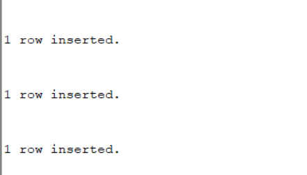
```
```

#.13. Find all sids of sailors who have a rating of 10 or have reserved boat 104.
```
SELECT sid FROM Sailors
WHERE rating = 10
UNION
SELECT sid FROM Reserves
WHERE bid = 104;
```
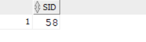
```
```
#.14. Find the names of sailors who have reserved boat 103.
```
SELECT sname
FROM Sailors
WHERE sid IN (
SELECT sid
FROM Reserves
WHERE bid = 103);
```
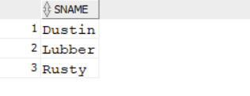
```
```
#.15. Find the names of sailors who have reserved a red boat.
```
.SELECT DISTINCT r.sid FROM Reserves r, Boats b WHERE r.bid=b.bid AND b.color='red'
MINUS
SELECT DISTINCT r.sid FROM Reserves r, Boats b WHERE r.bid=b.bid AND b.color='green';
```
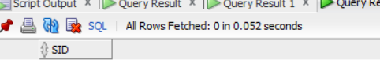
```
```
#.16. Find the names of sailors who have reserved boat number 103.
```
SELECT sname
FROM Sailors
WHERE sid IN (
SELECT sid
FROM Reserves
WHERE bid = 103);
```
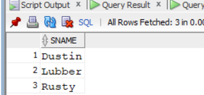
```
```
#.17. Find sailors whose rating is better than some sailor called Horatio.
```
SELECT *
FROM Sailors
WHERE rating > ANY (
SELECT rating
FROM Sailors
WHERE sname = 'Horatio');
```
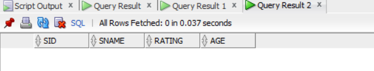
```
```
#.18. Find sailors whose rating is better than every sailor called Horatio.
```
SELECT *
FROM Sailors
WHERE rating > ALL (
SELECT rating
FROM Sailors
WHERE sname = 'Horatio');
```
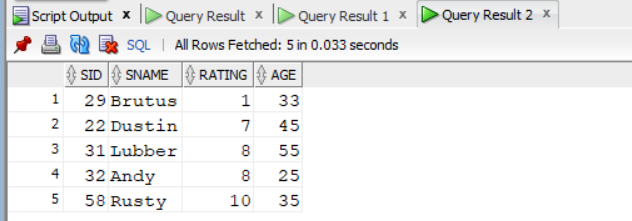
```
```
#.19. Find the sailors with the highest rating.
```
SELECT *
FROM Sailors
WHERE rating = (
SELECT MAX(rating)
FROM Sailors);
```
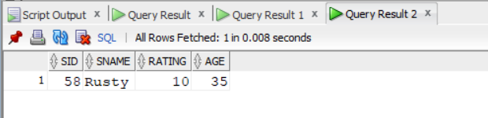
```
```
#.20. Find the names of sailors who have reserved both a red and a green boat.
```
SELECT s.sname FROM Sailors s WHERE EXISTS (SELECT * FROM Reserves r, Boats b WHERE s.sid=r.sid AND r.bid=b.bid AND b.color='red');
```
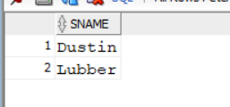
```
```
#.21. Find the names of sailors who have reserved all boats.
```
SELECT sname
FROM Sailors s
WHERE NOT EXISTS (
SELECT bid FROM Boats
MINUS
SELECT bid FROM Reserves
WHERE sid = s.sid);
```

```
```
#.22. Find the average age of all sailors.
```
SELECT AVG(age)
FROM Sailors;
```
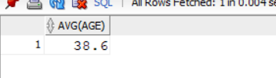
```
```
#.23. Find the average age of sailors with a rating of 10.
```
SELECT AVG(age)
FROM Sailors
WHERE rating = 10;
```
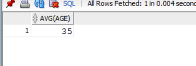
```
```
#.24. Find the name and age of the oldest sailor.
```
SELECT sname, age
FROM Sailors
WHERE age = (
SELECT MAX(age)
FROM Sailors);
```
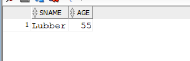
```
```
#.25. Count the number of sailors.
```
SELECT COUNT(*)
FROM Sailors;
```
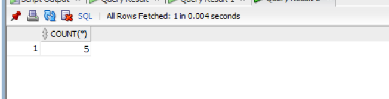
```
```
#.26. Count the number of different sailor names.
```
SELECT COUNT(DISTINCT sname)
FROM Sailors;
```
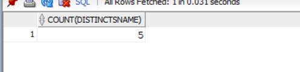
```
```
#.27. Find the names of sailors older than the oldest sailor with a rating of 10.
```
SELECT sname
FROM Sailors
WHERE age > (
SELECT MAX(age)
FROM Sailors
WHERE rating = 10);
```
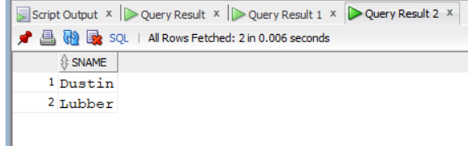
```
```
#.28. Find the age of the youngest sailor for each rating level.
```
SELECT rating, MIN(age)
FROM Sailors
GROUP BY rating;
```
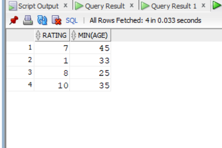
```
```
#.29. Find the age of the youngest sailor eligible to vote (age ≥ 18) for each rating level with at least two sailors.
```
SELECT rating, MIN(age)
FROM Sailors
WHERE age >= 18
GROUP BY rating
HAVING COUNT(*) >= 2;
```
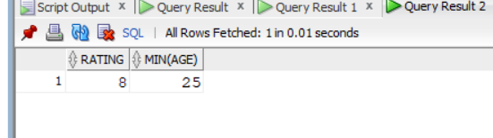
```
```
#.30. For each red boat, find the number of reservations.
```
SELECT AVG(age) FROM Sailors;

-- Red boats reserve count per boat
SELECT b.bid, COUNT(*) FROM Boats b, Reserves r WHERE b.bid = r.bid AND b.color = 'red' GROUP BY b.bid;

-- Green boats reserved
SELECT s.sname FROM Sailors s, Reserves r, Boats b WHERE s.sid=r.sid AND r.bid=b.bid AND b.color='green';

-- Sids who reserved red AND green
SELECT s.sname FROM Sailors s, Reserves r, Boats b WHERE s.sid=r.sid AND r.bid=b.bid AND b.color='red'
INTERSECT
SELECT s.sname FROM Sailors s, Reserves r, Boats b WHERE s.sid=r.sid AND r.bid=b.bid AND b.color='green';
```
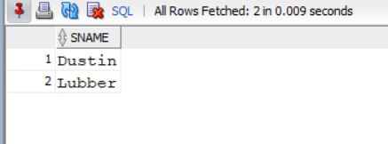
```
```
#.31. Find the average age of sailors for each rating level that has at least two sailors.
```
SELECT rating, AVG(age)
FROM Sailors
GROUP BY rating
HAVING COUNT(*) >= 2;
```
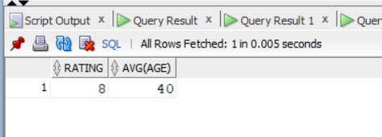
```
```
#.32. Find the average age of voting-age sailors (≥18) for each rating level with at least two sailors.
```
SELECT rating, AVG(age)
FROM Sailors
WHERE age >= 18
GROUP BY rating
HAVING COUNT(*) >= 2;
```
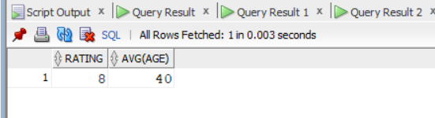
```
```
#.33. Find the average age of voting-age sailors (≥18) for each rating level with at least two such sailors.
```
SELECT rating, AVG(age)
FROM Sailors
WHERE age >= 18
GROUP BY rating
HAVING COUNT(*) >= 2;
```
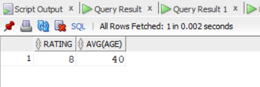
```
```
#.34. Find the ratings for which the average age is the minimum.
```
SELECT rating
FROM Sailors
GROUP BY rating
HAVING AVG(age) <= ALL (
SELECT AVG(age)
FROM Sailors
GROUP BY rating);
```

```
```


