#.A.1
```
SELECT EMPLOYEE_ID, FIRST_NAME,
       TO_CHAR(HIRE_DATE, 'DD-MON-YYYY') AS HIRE_DATE
FROM EMPLOYEE;
```
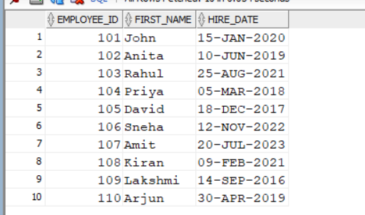
```
```
#.A.2
```
SELECT EMPLOYEE_ID, FIRST_NAME,
       TO_CHAR(SALARY, 'L99,999,999') AS SALARY
FROM EMPLOYEE;
```
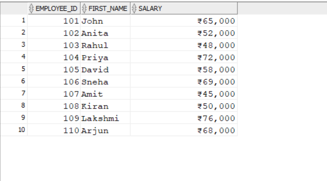
```
```
#.A.3
```
SELECT EMPLOYEE_ID, FIRST_NAME,
       TO_NUMBER(SALARY) + 5000 AS NEW_SALARY
FROM EMPLOYEE;
```

```
```
#.A.4
```
SELECT *
FROM EMPLOYEE
WHERE HIRE_DATE > TO_DATE('01-JAN-2020', 'DD-MON-YYYY');
```
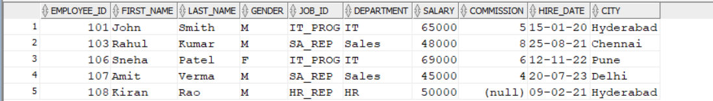
```
```
#.A.5
```
SELECT EMPLOYEE_ID,
       FIRST_NAME || ' ' || LAST_NAME AS FULL_NAME
FROM EMPLOYEE;
```
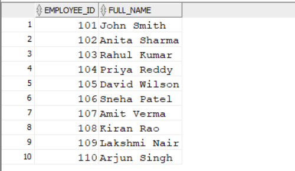
```
```
#.A.6
```
SELECT EMPLOYEE_ID,
       CONCAT(FIRST_NAME, CONCAT(' ', LAST_NAME)) AS FULL_NAME
FROM EMPLOYEE;
```
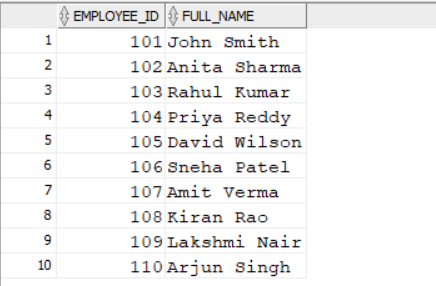
```
```
#.A.7
```
SELECT FIRST_NAME,
       LPAD(FIRST_NAME, 10, '*') AS PADDED_NAME
FROM EMPLOYEE;
```
[output](o7.png)
```
```
#.A.8
```
SELECT FIRST_NAME,
       RPAD(FIRST_NAME, 10, '*') AS PADDED_NAME
FROM EMPLOYEE;
```
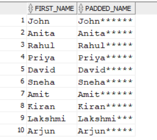
```
```
#.A.9
```
SELECT FIRST_NAME,
       LTRIM(FIRST_NAME) AS TRIMMED_NAME
FROM EMPLOYEE;
```
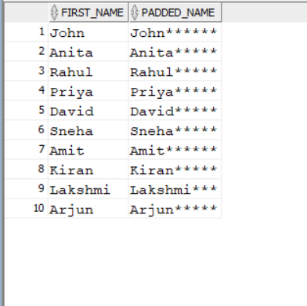
```
```
#.A.10
```
SELECT FIRST_NAME,
       RTRIM(FIRST_NAME) AS TRIMMED_NAME
FROM EMPLOYEE;
```
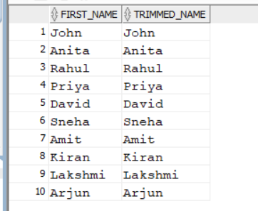
```
```
#.A.11
```
SELECT FIRST_NAME,
       LOWER(FIRST_NAME) AS LOWERCASE_NAME
FROM EMPLOYEE;
```
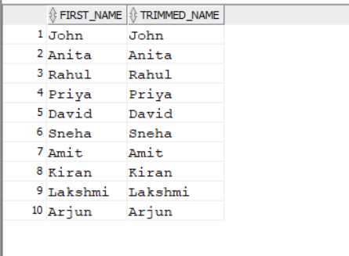
```
```
#.A.12
```
SELECT FIRST_NAME,
       UPPER(FIRST_NAME) AS UPPERCASE_NAME
FROM EMPLOYEE;
```
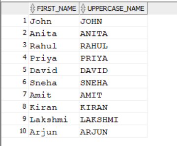
```
```
#.A.13
```
SELECT FIRST_NAME,
       INITCAP(FIRST_NAME) AS PROPER_NAME
FROM EMPLOYEE;
```
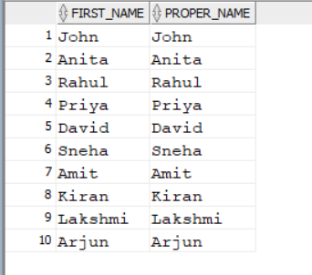
```
```
#.A.14
```
SELECT FIRST_NAME,
       LENGTH(FIRST_NAME) AS NAME_LENGTH
FROM EMPLOYEE;
```
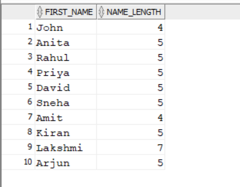
```
```
#.A.15
```
SELECT FIRST_NAME,
       SUBSTR(FIRST_NAME, 1, 3) AS FIRST_THREE
FROM EMPLOYEE;
```
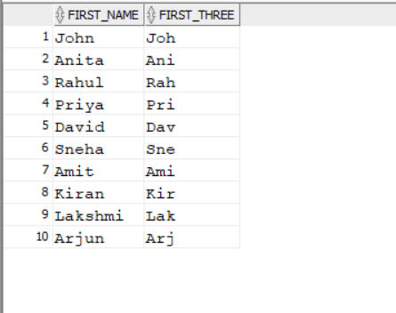
#.A.16
```
SELECT FIRST_NAME,
       INSTR(LOWER(FIRST_NAME), 'a') AS POSITION_OF_A
FROM EMPLOYEE;
```
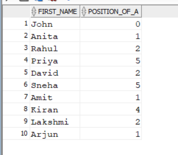
```
```
#.A.17
```
SELECT EMPLOYEE_ID, FIRST_NAME, LAST_NAME,
       HIRE_DATE, SYSDATE AS CURRENT_DATE
FROM EMPLOYEE;
```
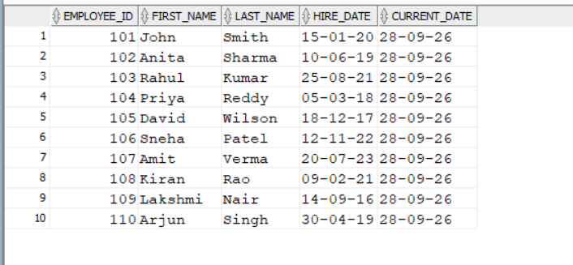
```
```
#.A.18
```
SELECT EMPLOYEE_ID, FIRST_NAME, HIRE_DATE,
       NEXT_DAY(HIRE_DATE, 'MONDAY') AS NEXT_MONDAY
FROM EMPLOYEE;
```
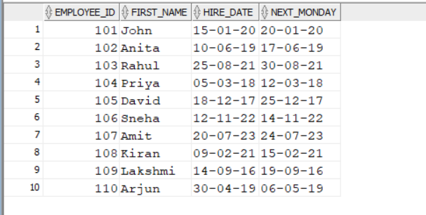
```
```
#.A.19
```
SELECT EMPLOYEE_ID, FIRST_NAME, HIRE_DATE,
       ADD_MONTHS(HIRE_DATE, 6) AS AFTER_SIX_MONTHS
FROM EMPLOYEE;
```
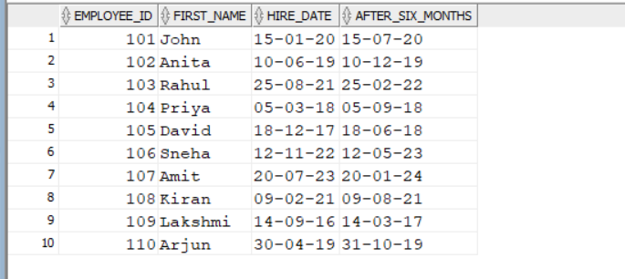
```
```
#.A.20
```
SELECT EMPLOYEE_ID, FIRST_NAME, HIRE_DATE,
       LAST_DAY(HIRE_DATE) AS LAST_DAY_OF_MONTH
FROM EMPLOYEE;
```
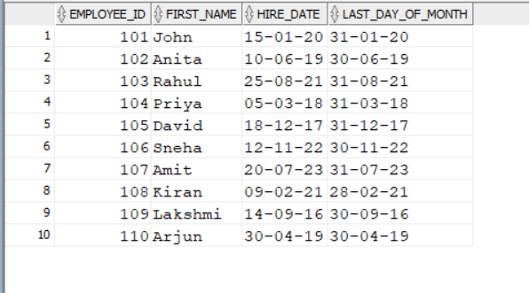
```
```
#.A.21
```
SELECT EMPLOYEE_ID, FIRST_NAME, HIRE_DATE,
       ROUND(MONTHS_BETWEEN(SYSDATE, HIRE_DATE), 2) AS MONTHS_WORKED
FROM EMPLOYEE;
```
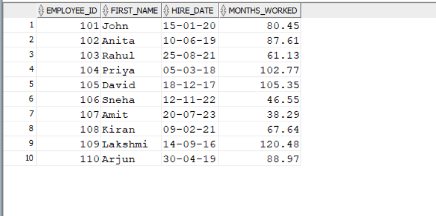
```
```
#.A.22
```
SELECT EMPLOYEE_ID, FIRST_NAME, SALARY,
       LEAST(SALARY, 60000) AS SMALLER_VALUE
FROM EMPLOYEE;
```
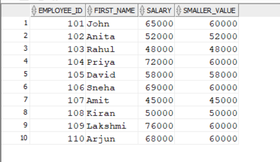
```
```
#.A.23
```
SELECT EMPLOYEE_ID, FIRST_NAME, SALARY,
       GREATEST(SALARY, 60000) AS GREATER_VALUE
FROM EMPLOYEE;
```
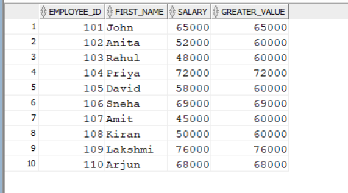
```
```
#.A.24
```
SELECT EMPLOYEE_ID, FIRST_NAME, HIRE_DATE,
       TRUNC(HIRE_DATE, 'MONTH') AS FIRST_DAY_OF_MONTH
FROM EMPLOYEE;
```
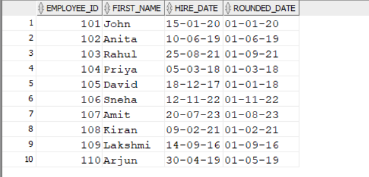
```
```
#.A.25
```
SELECT EMPLOYEE_ID, FIRST_NAME, HIRE_DATE,
       ROUND(HIRE_DATE, 'MONTH') AS ROUNDED_DATE
FROM EMPLOYEE;
```

```
```
#.A.26
```
SELECT EMPLOYEE_ID, FIRST_NAME,
       TO_CHAR(HIRE_DATE, 'DAY, DD-MON-YYYY') AS FORMATTED_DATE
FROM EMPLOYEE;
```
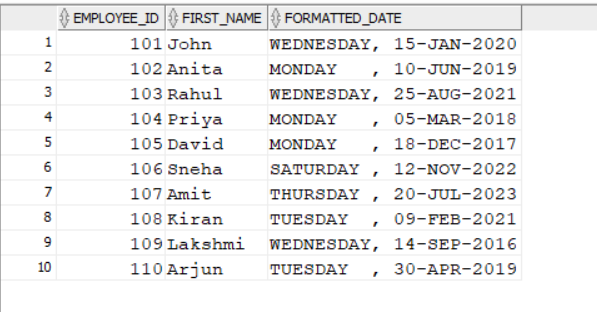
```
```
#.A.27
```
SELECT *
FROM EMPLOYEE
WHERE HIRE_DATE < TO_DATE('01-JAN-2019', 'DD-MON-YYYY');
```

```
```

#.B.1
```
CREATE VIEW EMP_VIEW AS
SELECT *
FROM EMPLOYEE;
```
.png)
```
```
#.B.2
```
CREATE VIEW EMP_BASIC AS
SELECT EMPLOYEE_ID, FIRST_NAME, LAST_NAME, DEPARTMENT, SALARY
FROM EMPLOYEE;
```
.png)
```
```
#.B.3
```
SELECT *
FROM EMP_VIEW;
```
.png)
```
```
#.B.4
```
CREATE VIEW IT_EMPLOYEES AS
SELECT *
FROM EMPLOYEE
WHERE DEPARTMENT = 'IT';
```
.png)
```
```
#.B.5
```
CREATE VIEW HIGH_SALARY AS
SELECT *
FROM EMPLOYEE
WHERE SALARY > 60000;
```
.png)
```
```
#.B.6
```
CREATE VIEW HYDERABAD_EMP AS
SELECT *
FROM EMPLOYEE
WHERE CITY = 'Hyderabad';
```
.png)
```
```
#.B.7
```
CREATE VIEW FEMALE_EMP AS
SELECT *
FROM EMPLOYEE
WHERE GENDER = 'Female';
```
.png)
```
```
#.B.8
```
CREATE VIEW RECENT_EMPLOYEES AS
SELECT *
FROM EMPLOYEE
WHERE HIRE_DATE >= TO_DATE('01-JAN-2020','DD-MON-YYYY');
```
.png)
```
```
#.B.9
```
SELECT EMPLOYEE_ID, FIRST_NAME, SALARY
FROM HIGH_SALARY;
```
.png)
```
```
#.B.10
```
CREATE OR REPLACE VIEW EMP_BASIC AS
SELECT EMPLOYEE_ID, FIRST_NAME, LAST_NAME,
       DEPARTMENT, SALARY, CITY
FROM EMPLOYEE;
```
.png)
```
```
#.B.11
```
CREATE VIEW EMP_SALARY_VIEW AS
SELECT EMPLOYEE_ID, FIRST_NAME, LAST_NAME, SALARY
FROM EMPLOYEE
WITH READ ONLY;
```
.png)
```
```
#.B.12
```
CREATE VIEW SALES_EMP AS
SELECT *
FROM EMPLOYEE
WHERE DEPARTMENT = 'Sales'
WITH CHECK OPTION;
```
.png)
```
```
#.B.13
```
UPDATE EMP_BASIC
SET SALARY = 75000
WHERE EMPLOYEE_ID = 101;
```
.png)
```
```

#.B.14
```
DELETE FROM EMP_VIEW
WHERE EMPLOYEE_ID = 107;
```
.png)
```
```

#.B.15
```
INSERT INTO EMP_BASIC
VALUES (111, 'Ravi', 'Kumar', 'IT', 50000, 'Hyderabad');
```
.png)
```
```

#.B.16
```
DESC EMP_BASIC;
```
.png)
```
```
#.B.17
```
SELECT *
FROM IT_EMPLOYEES;
```
.png)
```
```
#.B.18
```
SELECT *
FROM HIGH_SALARY
WHERE SALARY > 70000;
```
.png)
```
```
#.B.19
```
SELECT *
FROM FEMALE_EMP;
```
.png)
```
```
#.B.20
```
SELECT FIRST_NAME, SALARY
FROM HYDERABAD_EMP;
```
.png)
```
```
#.B.21
```
DROP VIEW EMP_VIEW;
```
.png)
```
```
#.B.22
```
DROP VIEW HIGH_SALARY;
```
.png)
```
```
#.B.23
```
DROP VIEW EMP_BASIC;
```
.png)
```
```
#.B.24
```
CREATE VIEW HR_EMPLOYEES AS
SELECT *
FROM EMPLOYEE
WHERE DEPARTMENT = 'HR';
```
.png)
```
```
#.B.25
```
CREATE VIEW MARKETING_EMP AS
SELECT EMPLOYEE_ID, FIRST_NAME, DEPARTMENT, SALARY
FROM EMPLOYEE
WHERE DEPARTMENT = 'Marketing';
```
.png)
```
```
#.B.26
```
CREATE VIEW TOP_EARNERS AS
SELECT *
FROM EMPLOYEE
WHERE SALARY > 70000;
```
.png)
```
```
#.B.27
```
CREATE VIEW EMP_CITY AS
SELECT EMPLOYEE_ID, FIRST_NAME, LAST_NAME, CITY
FROM EMPLOYEE;
```
.png)
```
```


